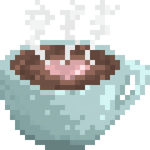

Here's a cup of coffee for your trouble.

I'm a software engineer dedicated to developing artistically novel graphics tools. It's my personal goal to equip artists with more creative and efficient utilities -- aka to fuel the creation of more deeply believable, beautiful, and expansive visual stories. I'm a programmer by craft, and a creative at heart!

Here, I post about computer graphics, animation, and associated concepts that I've been learning and building. I hope you find some interesting topics and/or projects that spark your curiosity as well.

Since you've taken the time to learn about me, I'd love to learn about _you_ too. Please do drop a note, my contact info is below!

Yours,  
Jeesoo

## say hello -
I'm always open to meeting new friends and talking about cool ideas, whether it be professional or just about coffee and my/your cat.

You can connect with me on [LinkedIn](https://www.linkedin.com/in/jeesookim), or send me an [email](mailto:jeesookim@gmail.com). Just let me know you stopped by my blog -- I'll be thrilled to chat!

Thanks for hanging out!
